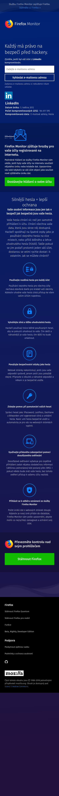
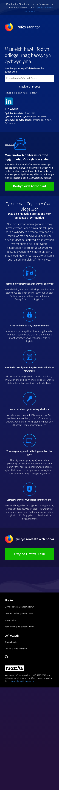
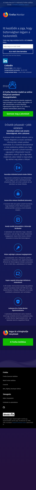
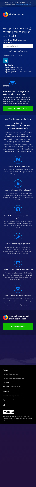
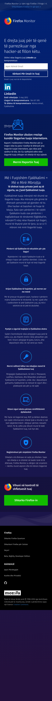
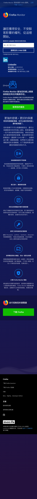

http://fx-breach-alerts.herokuapp.com?breach=linkedin
2018-11-12
### cs

### cy

### de

### en-CA

### es-AR

### es-ES

### es-MX

### fr

### fy-NL

### hu

### id

### it

### ja

### ms

### nl

### pt-BR

### pt-PT

### ru

### sk

### sl

### sq

### sv-SE

### tr

### uk

### zh-CN

### zh-TW

