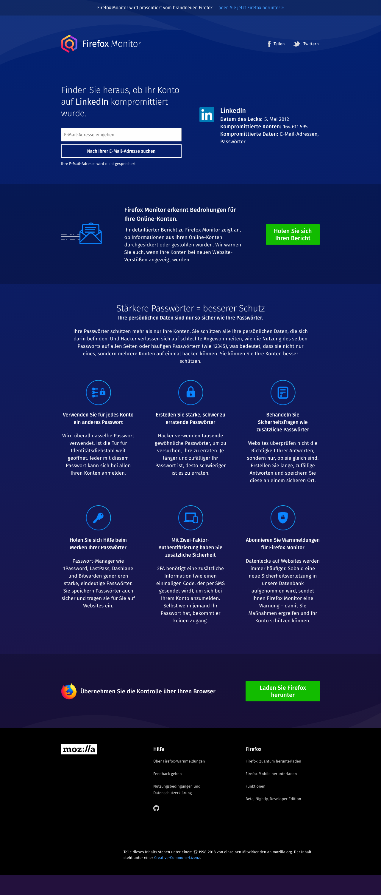
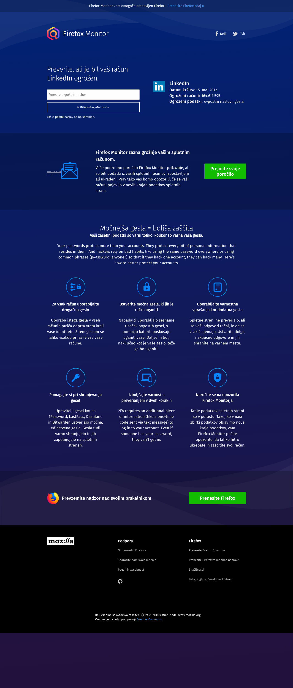
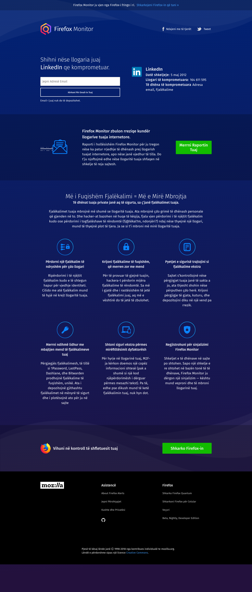
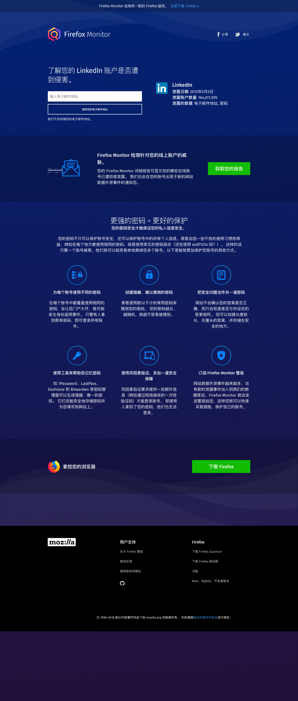
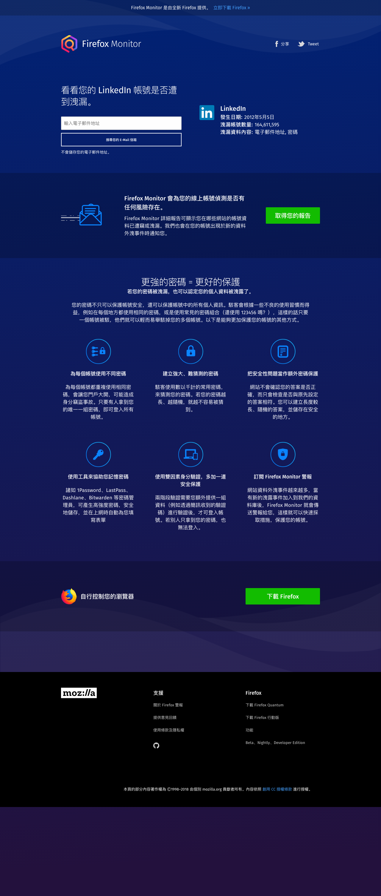

http://stage.firefoxmonitor.nonprod.cloudops.mozgcp.net/?breach=linkedin
2019-01-08
### cs

### cy

### da

### de

### en-CA

### es-AR

### es-CL

### es-ES

### es-MX

### fr

### fy-NL

### hu

### ia

### id

### it

### ja

### ms

### nl

### pt-BR

### pt-PT

### ro

### ru

### sk

### sl

### sq

### sv-SE

### tr

### uk

### vi

### zh-CN

### zh-TW

